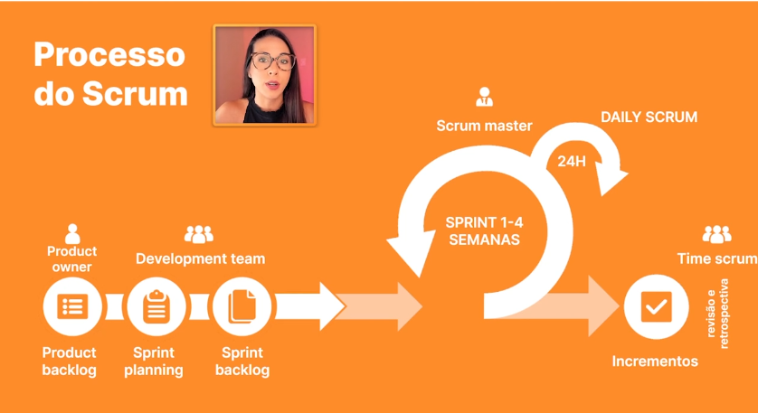

# Processo de Scrum

### Product Owner

Representa o usuario final do projeto no caso o cliente, então a pessoa responsavel pelo Product Owner irá ser responsavel pelas prioridades do projeto e as necessidades que o usuario final necessita

Sendo assim ele irá ser responsavel pela criação do Product BackLog

### Product BackLog

É um documento onde irá constar as necessidades, funcionalidades, que o cliente final necessita, e tambem a base do projeto, então é de extrema importancia esse documento estar bem detalhado e objetivo!

## Development Team

Antes de começar a realizar o desenvolvilmento do projeto a equipe se junta em uma sprint planning

### Sprints
Sprint são ciclos de trabalhos com tempo determinado ( geralmente ocorre entre 1-4 semanas)

### Sprint Planing

É uma reunião inicial da equipe onde irão determinar os caminhos que o projeto seguirá e realizar

### Sprint BackLog

É a divisão de sprints por etapas, onde a equipe determinará o que será feito em cada etapa, então cada uma terá a sua sprint

### Daily Scrum

É uma reunião diaria aonde a equipe da Sprint terá que seguir

### Incrementos

Ao final de cada sprint é necessario realizar a entrega de Incrementos da sprint

### Sprint Retrospectiv
 
É a etapa final aonde a equipe se reune antes de se iniciar a proxima Sprint, sendo isso a equipe se reune para averiguar se todos os objetivos da sprint atual foi concluida, ideias para melhorias para as proximas, etc

